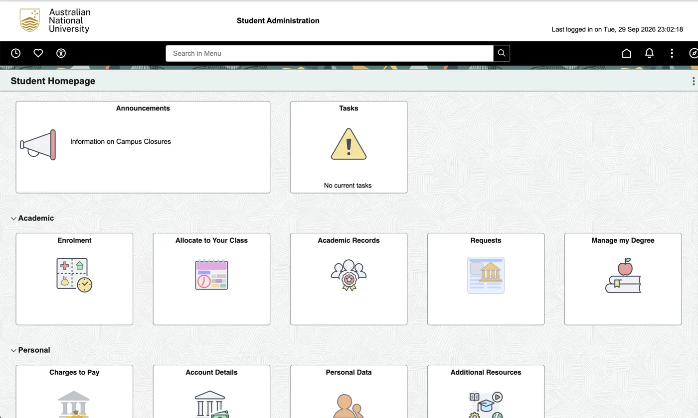
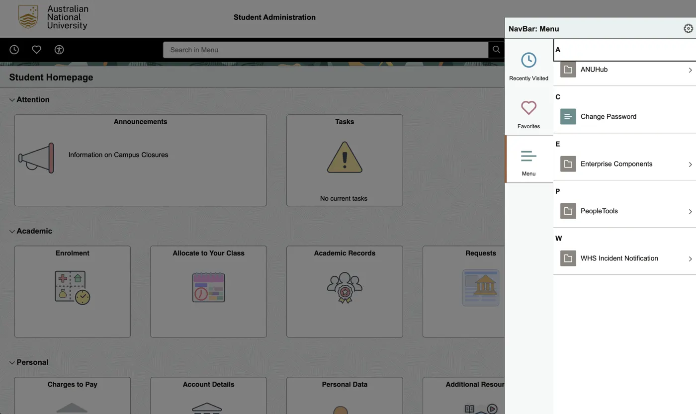
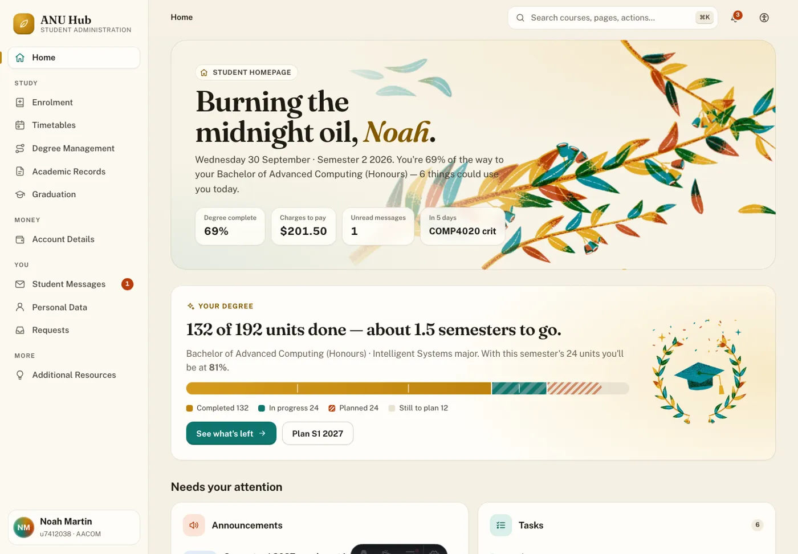
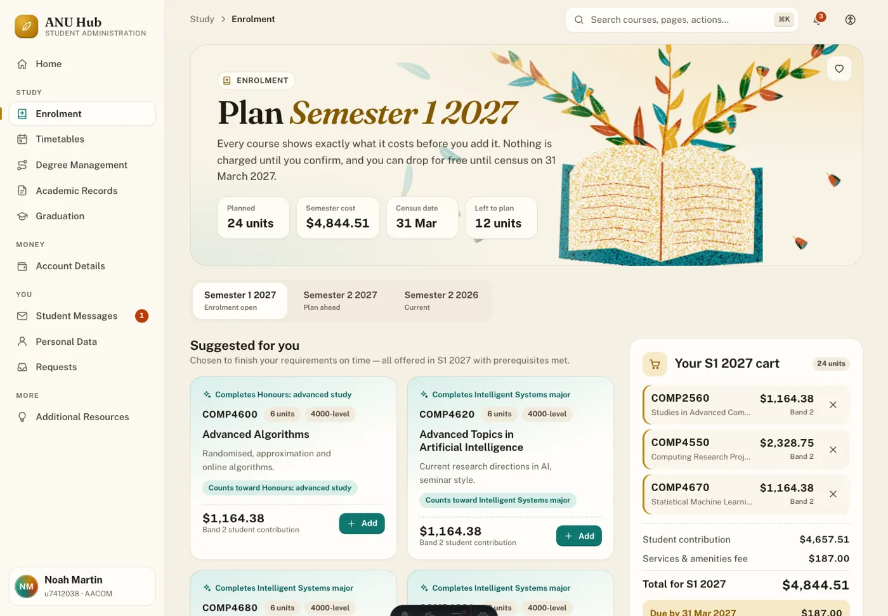

# ANU Hub, redesigned

ANU Hub (formerly ISIS) is where every ANU student enrols, allocates classes, pays fees, checks results and applies to graduate. This prototype rebuilds it as a full-stack app — Astro, SQLite and Drizzle on Fly.io — around one sample student in the final stretch of a Bachelor of Advanced Computing (Honours). Everything a student does here persists: carts, enrolments, class allocations, payments, read messages, requests, preferences.

## What good looks like here

I started from screenshots of the live ANU Hub and wrote down what makes it a burden to use:

- **The menu leaks the system's internals.** The navigation drawer is an A–Z list of installed modules — ANUHub, Change Password, Enterprise Components, PeopleTools, WHS Incident Notification — with vendor admin tools sitting next to the things students need.
- **Three navigation systems disagree.** A search box, a tile grid and the drawer each use different names for the same destination.
- **Nothing is prioritised.** Enrolment, Charges to Pay and Change Password get identical grey tiles; the only alarm icon is spent on an empty "No current tasks" card.
- **Money is hidden.** You can't see what a course costs until after you've enrolled in it.
- **Finishing a degree isn't celebrated.** Progress lives in a requirements report, not somewhere you'd feel proud of it.

I compared it with tools that do this well. Linear and Stripe keep one source of navigation truth and label things by task; command palettes (Notion, Linear, GitHub) replace "search box + tiles + drawer" with one fast search; and Canvas — which ANU students already use every day — shows that cards with a consistent icon language and meaningful badges work for this audience.

So good, for this app, means:

1. **One information architecture.** Every ANUHub topic — Academic Records, Account Details, Degree Management, Enrolment, Graduation, Personal Data, Student Messages, Timetables — sits in a sidebar grouped by what you're doing (Study, Money, You), and a ⌘K palette searches pages, courses and deep links from anywhere.
2. **Nothing removed.** Every tile and menu item from the old ANU Hub is still reachable, grouped where it makes sense. Change Password lives in Personal Data, WHS Incident Notification is a request type, and Enterprise Components and PeopleTools sit in a clearly labelled System menu instead of your main navigation.
3. **Prices before commitment.** Every course card shows its student contribution and funding band. The cart totals tuition and SSAF, splits "due by census" from "deferred to HECS-HELP", and the census-date rule is spelled out before you drop.
4. **Rules explained as you plan.** Checks run live against your record: the 10-course (60-unit) first-year limit, overloads above 24 units, prerequisites, offerings, the 3000-level minimum, and courses that won't count toward anything. Suggestions are the courses that actually finish your requirements.
5. **Celebrate the degree.** A progress bar with milestones on the homepage, requirement rings, a study-plan timeline, "moments worth celebrating", a graduation countdown, and confetti when you register to graduate.
6. **Personal, fast and smooth.** It greets you by your preferred name. Pages are server-rendered from SQLite in milliseconds and prefetched on hover; navigation uses cross-document view transitions, and forms update in place without losing your scroll. Motion respects reduced-motion settings, and there's an in-app switch for theme, motion and text size.
7. **Art that feels like ANU.** The riso-print eucalyptus and gumnut illustrations are generated by `scripts/art/generate.py` in the gold, teal and rust inks of the COMP4020 course site.

### What's enforced and what's judgement

The checks in `spec/` enforce the promises a test can hold: every topic is linked from navigation and loads; every legacy item is still offered; the greeting uses the preferred name and survives a change; progress reads as units out of 192; prices appear before a course is added and the cart survives a reload; the first-year limit warns at 11 courses; unoffered courses are refused; class allocations and read messages persist. The shipped invariants add a navigation landmark, a single h1 and an axe accessibility pass on every route.

Whether it's *clearer*, *more appealing* and *feels fast* is judgement — mine, and the crit's.

### What I chose not to build

Real sign-in and live ANU data. ANU Hub sits behind Microsoft single sign-on with no student API, and scripting access to it isn't something to do without ANU's approval, so the student, courses, fees and dates are realistic sample data. Fee figures are indicative, not ANU's published rates. Payments are simulated, and Change Password records only *when* it changed — never the password.
